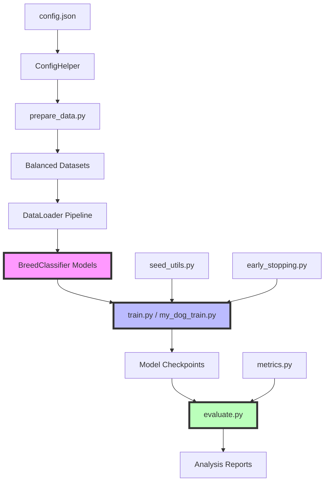

# Analisi Approfondita del Codebase - Dog Identifier

## Panoramica del Progetto

Il **Dog Identifier** è un progetto di classificazione di razze canine che implementa un sistema scalabile di machine learning, capace di gestire da 5 a 121 razze diverse. Il progetto dimostra competenze in deep learning, computer vision e ingegneria del software, con particolare focus su:

- **CNN from-scratch personalizzate** (requisito corso AI13)
- **Transfer Learning** per confronti scientifici
- **Scalabilità** da 5 a 121 razze
- **Riproducibilità** e sperimentazione scientifica
- **Focus specifico** su Australian Shepherd

---

## 1. utils/seed_utils.py

**Complessità**: ⭐ (Semplice - 33 righe)  
**Ruolo**: Riproducibilità degli esperimenti

### Analisi Tecnica

Questo modulo implementa la **riproducibilità deterministica** per gli esperimenti di machine learning, un requisito fondamentale per la ricerca scientifica.

```python
def set_deterministic(seed: int = 42) -> None:
```

### Funzionalità Chiave

1. **Controllo Completo dei Generatori Random**:

   - `PYTHONHASHSEED`: Hash operations deterministiche
   - `random.seed()`: Random Python standard
   - `np.random.seed()`: NumPy random operations
   - `torch.manual_seed()`: PyTorch CPU operations
   - `torch.cuda.manual_seed_all()`: PyTorch GPU (tutti i device)

2. **Configurazione cuDNN**:
   - `deterministic=True`: Garantisce operazioni deterministiche
   - `benchmark=False`: Disabilita auto-tuning per consistency

### Design Philosophy

Il trade-off **riproducibilità vs performance** è gestito in modo esplicito:

- ✅ **Pro**: Esperimenti perfettamente riproducibili
- ⚠️ **Contro**: Performance leggermente ridotte (5-10%)

### Utilizzo nel Progetto

Chiamato all'inizio di tutti gli script di training per garantire:

- Stessi risultati tra esecuzioni diverse
- Comparabilità scientifica dei modelli
- Debug deterministico

---

## 2. utils/early_stopping.py

**Complessità**: ⭐⭐ (Intermedio - 69 righe)  
**Ruolo**: Prevenzione overfitting durante il training

### Analisi Tecnica

Implementa il pattern **Early Stopping** per il training deep learning, fondamentale per:

1. Prevenire overfitting (memorizzazione training set)
2. Risparmiare tempo computazionale
3. Ottenere modelli con migliore generalizzazione
4. Evitare degradazione su validation set

```python
class EarlyStopping:
    def __init__(self, patience=7, verbose=False, delta=0):
```

### Algoritmo di Funzionamento

1. **Monitoraggio Validation Loss**: Converte loss in score (`score = -val_loss`)
2. **Tracking del Miglior Score**: Mantiene `best_score` e `val_loss_min`
3. **Sistema di Patience**: Counter incrementale per epoche senza miglioramento
4. **Soglia Delta**: Miglioramento minimo significativo per reset counter
5. **Trigger Stop**: Quando `counter >= patience` → ferma training

### Caratteristiche Avanzate

- **Delta Threshold**: Evita stop per miglioramenti trascurabili
- **Verbose Logging**: Debug information opzionale
- **NumPy 2.0+ Compatibility**: Gestione corretta `np.inf`

### Pattern di Utilizzo

```python
early_stopping = EarlyStopping(patience=7)
for epoch in range(epochs):
    # ... training logic ...
    if early_stopping(val_loss):
        break  # Stop training
```

---

## 3. utils/config_helper.py

**Complessità**: ⭐⭐⭐ (Intermedio+ - 163 righe)  
**Ruolo**: Sistema di configurazione centralizzato

### Analisi Tecnica

Implementa un **sistema di configurazione robusto** per la gestione di parametri complessi del progetto ML, con support per:

- **Dot notation access** (`config.get('data.batch_size')`)
- **Creazione automatica directories**
- **Validazione configurazioni**
- **Metodi di convenienza** per sezioni specifiche

```python
class ConfigHelper:
    def __init__(self, config_path: str = "config.json"):
```

### Funzionalità Core

#### 1. **Dot Notation System**

```python
def get(self, key: str, default: Any = None) -> Any:
    keys = key.split(".")
    # Naviga struttura nested: parent.child.grandchild
```

Permette accesso elegante a configurazioni nested:

- `config.get('data.batch_size')` → `32`
- `config.get('model.breed_classifier.num_classes')` → `121`
- `config.get('training.learning_rate')` → `0.0008`

#### 2. **Auto-Directory Creation**

```python
def _create_directories(self):
    directories = [
        self.config["data"]["breed_dataset_path"],
        self.config["data"]["my_dog_dataset_path"],
        self.config["paths"]["output_dir"],
        # ... altri path
    ]
```

#### 3. **Metodi Specializzati**

- `get_data_config()`: Configurazioni dataset
- `get_model_config()`: Parametri architettura modello
- `get_training_config()`: Iperparametri training
- `get_augmentation_config()`: Data augmentation settings

### Design Patterns

- **Singleton-like**: Un'istanza per progetto
- **Fail-Safe**: Default values per chiavi mancanti
- **Validation**: Path existence checks
- **Flexibility**: Update e save configurazioni runtime

### Utilizzo Avanzato

```python
config = ConfigHelper()
# Dot notation access
batch_size = config.get('data.batch_size', 32)
# Section-specific methods
train_config = config.get_training_config()
# Runtime updates
config.update_config({'training.learning_rate': 0.001})
```

---

## 4. models/**init**.py

**Complessità**: ⭐ (Minimo - 1 riga)  
**Ruolo**: Package marker

### Analisi Tecnica

File **package marker** standard Python che rende `models/` un pacchetto importabile.

```python
# Package modelli per identificatore razze canine
```

### Funzione nel Progetto

- **Namespace Definition**: Definisce `models` come package
- **Import Facilitation**: Permette `from models.breed_classifier import ...`
- **Package Structure**: Parte dell'organizzazione modulare del codice
- **Documentation**: Comment descrive contenuto package

### Best Practice

- Mantiene struttura pulita e professionale
- Facilita import modules
- Documenta purpose del package

---

## 5. utils/metrics.py

**Complessità**: ⭐⭐⭐⭐ (Avanzato - 360+ righe)  
**Ruolo**: Sistema di valutazione e visualizzazione metriche ML

### Analisi Tecnica

Modulo **completo di evaluation** per modelli di classificazione, che implementa:

1. **Calcolo Metriche Comprehensive**
2. **Visualizzazioni Professionali**
3. **Model Interpretability** (Grad-CAM)
4. **Export e Reporting**

### Funzionalità Core

#### 1. **Calcolo Metriche Multi-Class**

```python
def calculate_metrics(y_true, y_pred, y_prob=None) -> Dict[str, float]:
    # Basic metrics
    metrics['accuracy'] = accuracy_score(y_true, y_pred)
    # Precision, Recall, F1
    precision, recall, f1, _ = precision_recall_fscore_support(
        y_true, y_pred, average='weighted'
    )
    # ROC-AUC per multi-class
    if y_prob is not None:
        metrics['roc_auc'] = roc_auc_score(y_true, y_prob, multi_class='ovr')
```

**Metriche Supportate**:

- **Accuracy**: Classificazione globale
- **Precision/Recall/F1**: Weighted average per multi-class
- **ROC-AUC**: One-vs-Rest per problemi multi-class

#### 2. **Confusion Matrix Visualization**

```python
def plot_confusion_matrix(y_true, y_pred, class_names, save_path=None, normalize=True):
```

Features avanzate:

- **Normalizzazione opzionale**: Percentuali vs count assoluti
- **Heatmap professionale**: Seaborn styling
- **Class name handling**: Supporto nomi lunghi con troncamento
- **High-DPI export**: 300 DPI per pubblicazioni

#### 3. **Training History Visualization**

```python
def plot_training_history(history: Dict[str, List[float]], save_path=None):
```

Dual-plot layout:

- **Loss curves**: Train vs Validation loss nel tempo
- **Accuracy curves**: Train vs Validation accuracy nel tempo
- **Professional styling**: Grid, legends, proper labeling

#### 4. **Model Interpretability - Grad-CAM**

```python
def visualize_grad_cam(model, image, target_class, layer_name="features", save_path=None):
```

**Implementazione Grad-CAM completa**:

- **Hook-based activation capture**: Forward hooks per feature maps
- **Gradient computation**: Backward pass per target class
- **Heatmap generation**: Weighted combination of activations
- **Visualization pipeline**: Original → Heatmap → Overlay

**Output Triple-View**:

1. **Original Image**: Input non processato
2. **Grad-CAM Heatmap**: Activation intensity map
3. **Overlay Visualization**: Heatmap sovrapposta all'immagine

### Design Patterns Avanzati

#### **Error Handling Robusto**

```python
try:
    if len(y_prob.shape) == 1:
        # Binary classification
        metrics['roc_auc'] = roc_auc_score(y_true, y_prob)
    else:
        # Multi-class classification
        metrics['roc_auc'] = roc_auc_score(y_true, y_prob, multi_class='ovr')
except ValueError:
    metrics['roc_auc'] = 0.0  # Graceful fallback
```

#### **Flexible Save System**

```python
if save_path:
    plt.savefig(save_path, dpi=300, bbox_inches='tight')
    print(f"📊 Confusion matrix saved to {save_path}")
plt.show()
```

### Utilizzo nel Progetto

Il modulo viene utilizzato in:

- **src/evaluate.py**: Analisi post-training completa
- **Training scripts**: Logging metriche intermedie
- **Model comparison**: Confronti scientifici tra architetture

---

## 6. models/breed_classifier.py

**Complessità**: ⭐⭐⭐⭐⭐ (Avanzato - 345 righe)  
**Ruolo**: Architetture CNN personalizzate per classificazione razze

### Analisi Tecnica Approfondita

Questo modulo implementa il **cuore tecnico** del progetto: architetture CNN personalizzate progettate from-scratch per la classificazione di razze canine, con supporto opzionale per transfer learning.

### Architettura Principale: BreedClassifier

#### **Design Philosophy - VGG-like Personalizzata**

```python
class BreedClassifier(nn.Module):
    """
    Architettura VGG-like personalizzata con 134M parametri:
    - 5 blocchi convoluzionali con feature maps crescenti (64→128→256→512→512)
    - Batch normalization per stabilità training
    - Dropout 2D per regolarizzazione convoluzionale
    - 3 layer fully connected per classificazione finale
    - Adaptive average pooling per flessibilità input size
    """
```

#### **Blocchi Convoluzionali Progressivi**

**Blocco 1**: Feature di Basso Livello (Edge Detection)

```python
# 3 -> 64 canali (224x224 -> 112x112)
nn.Conv2d(3, 64, kernel_size=3, padding=1),  # Mantiene spatial size
nn.BatchNorm2d(64),  # Normalizzazione
nn.ReLU(inplace=True),  # Attivazione non-lineare
nn.Conv2d(64, 64, kernel_size=3, padding=1),  # Doppia convoluzione
nn.MaxPool2d(kernel_size=2, stride=2),  # Downsampling 2x
nn.Dropout2d(dropout_rate * 0.5),  # Dropout spaziale ridotto
```

**Blocchi 2-5**: Progressiva Feature Complexity

- **Blocco 2**: 64→128 canali (patterns, shapes)
- **Blocco 3**: 128→256 canali (textures, parts)
- **Blocco 4**: 256→512 canali (complex features)
- **Blocco 5**: 512→512 canali (high-level semantics)

#### **Sistema di Classificazione**

```python
self.classifier = nn.Sequential(
    nn.AdaptiveAvgPool2d((7, 7)),  # 512 x 7 x 7 = 25,088 features
    nn.Flatten(),  # Converte in vettore 1D
    nn.Linear(512 * 7 * 7, 4096),  # 25,088 -> 4,096 features
    nn.ReLU(inplace=True),
    nn.Dropout(dropout_rate),
    nn.Linear(4096, 4096),  # Mantiene 4,096 features
    nn.ReLU(inplace=True),
    nn.Dropout(dropout_rate),
    nn.Linear(4096, num_classes),  # Output finale
)
```

**Key Features**:

- **AdaptiveAvgPool2d**: Accetta input di qualsiasi dimensione
- **Progressive Dimensionality Reduction**: 25,088 → 4,096 → num_classes
- **Heavy Regularization**: Dropout per prevenire overfitting

### Weight Initialization System

```python
def _initialize_weights(self):
    for m in self.modules():
        if isinstance(m, nn.Conv2d):
            # Kaiming normal per layer convoluzionali con ReLU
            nn.init.kaiming_normal_(m.weight, mode="fan_out", nonlinearity="relu")
        elif isinstance(m, nn.BatchNorm2d):
            # Batch normalization: weight=1, bias=0
            nn.init.constant_(m.weight, 1)
            nn.init.constant_(m.bias, 0)
        elif isinstance(m, nn.Linear):
            # Layer lineari: distribuzione normale piccola
            nn.init.normal_(m.weight, 0, 0.01)
```

**Initialization Strategy**:

- **Conv2D**: Kaiming Normal (ottimale per ReLU activation)
- **BatchNorm**: Standard initialization (weight=1, bias=0)
- **Linear**: Small normal distribution per stabilità

### Architettura Semplificata: SimpleBreedClassifier

```python
class SimpleBreedClassifier(nn.Module):
    """Simplified CNN model per esperimenti di confronto"""
```

**Design per Test Rapidi**:

- **3 layer convoluzionali**: 32→64→128 canali
- **Architettura leggera**: ~1M parametri vs 134M
- **Training veloce**: Per prototipazione rapida

### Factory System con Transfer Learning

```python
def create_breed_classifier(
    model_type="full", num_classes=120, dropout_rate=0.5,
    pretrained_backbone=None, freeze_backbone=True
):
```

#### **Transfer Learning Support**

```python
if pretrained_backbone.lower() == "resnet18":
    backbone = models.resnet18(weights=models.ResNet18_Weights.IMAGENET1K_V1)
    in_features = backbone.fc.in_features
    backbone.fc = nn.Sequential(
        nn.Dropout(p=dropout_rate),
        nn.Linear(in_features, num_classes),
    )
    # Opzionalmente congela backbone
    if freeze_backbone:
        for name, param in model.named_parameters():
            if not name.startswith("fc."):
                param.requires_grad = False
```

### Caratteristiche Avanzate

#### **Model Summary System**

```python
def get_model_summary(model: nn.Module) -> str:
    total_params = sum(p.numel() for p in model.parameters())
    trainable_params = sum(p.numel() for p in model.parameters() if p.requires_grad)
```

#### **Flexible Architecture Selection**

- **model_type="full"**: BreedClassifier completo (134M params)
- **model_type="simple"**: SimpleBreedClassifier (1M params)
- **pretrained_backbone="resnet18"**: Transfer Learning

### Design Patterns Avanzati

1. **Modular Design**: Separazione feature extraction / classification
2. **Configurable Dropout**: Adattabile per diverse dataset scales
3. **Batch Normalization**: Per training stability
4. **Progressive Feature Maps**: 64→128→256→512→512
5. **Adaptive Pooling**: Flessibilità input dimensions

### Utilizzo nel Progetto

```python
# From Scratch - Architettura completa
model = create_breed_classifier("full", num_classes=121, dropout_rate=0.4)

# Transfer Learning - ResNet18 backbone
model = create_breed_classifier(
    pretrained_backbone="resnet18",
    freeze_backbone=True,
    num_classes=121
)
```

---

## 7. utils/dataloader.py

**Complessità**: ⭐⭐⭐⭐⭐ (Molto Avanzato - 955 righe)  
**Ruolo**: Sistema completo di gestione dati e pipeline preprocessing

### Analisi Tecnica Comprehensive

Questo è il **modulo più complesso del progetto**, implementando un sistema enterprise-level per:

1. **Dataset Management Multi-Scale** (5→121 razze)
2. **Advanced Data Augmentation Pipeline**
3. **Balanced Sampling Strategies**
4. **Professional Data Splitting**
5. **Dataset Analysis e Visualization**

### Classe Core: DogBreedDataset

#### **Multi-Scale Dataset Architecture**

```python
class DogBreedDataset(Dataset):
    def __init__(self, data_dir, transform=None, max_breeds=None, allowed_breeds=None):
```

**Funzionalità Chiave**:

- **Automatic Breed Discovery**: Scansione automatica cartelle razze
- **Flexible Scale Support**: 5, 10, 30, 60, 90, 121 razze
- **Explicit Breed Ordering**: `allowed_breeds` per controllo ordinamento
- **Validation e Statistics**: Analisi distribuzione dataset

#### **Discovery e Loading System**

```python
def _load_data(self, max_breeds: Optional[int] = None):
    # 1. Discovers all breed folders (alphabetical order)
    available_folders = {
        f.name: f for f in self.data_dir.iterdir()
        if f.is_dir() and not f.name.startswith(".")
    }

    # 2. Optionally limits to max_breeds for testing
    if self.allowed_breeds:
        breed_folders = [available_folders[breed] for breed in self.allowed_breeds]
    else:
        breed_folders = sorted(list(available_folders.values()), key=lambda p: p.name)
```

**Features Avanzate**:

- **Consistent Ordering**: Ordine alfabetico per riproducibilità
- **Explicit Breed Control**: `allowed_breeds` per subset specifici
- **Comprehensive Logging**: Progress tracking con dettagli per razza
- **Robust File Detection**: Support `.jpg`, `.jpeg`, `.png` (case-insensitive)

#### **Dataset Validation e Analysis**

```python
def _validate_dataset(self):
    # Calcola distribuzione razze
    breed_counts = Counter(self.labels)
    min_images = min(breed_counts.values())
    max_images = max(breed_counts.values())
    imbalance_ratio = max_images / min_images

    if imbalance_ratio > 5:
        print(f"⚠️ Sbilanciamento rilevato! Rapporto: {imbalance_ratio:.1f}:1")
```

**Analisi Comprehensive**:

- **Distribution Analysis**: Min, max, media immagini per razza
- **Imbalance Detection**: Warning per dataset sbilanciati (ratio > 5:1)
- **Statistical Reporting**: Report dettagliato con breed più/meno popolate

### Sistema Avanzato di Data Augmentation

#### **Professional Transform Pipeline**

```python
def get_transforms(image_size=(224, 224), augmentation_config=None):
    """
    Design Philosophy:
    1. Training transforms: Data augmentation per generalizzazione
    2. Validation transforms: Solo preprocessing per risultati consistenti
    3. ImageNet normalization: Compatibilità transfer learning
    """
```

#### **Training Augmentation Strategy**

```python
# 1. Spatial cropping: RandomResizedCrop or Resize+RandomCrop
if augmentation_config.get("random_resized_crop", False):
    transform_list.append(transforms.RandomResizedCrop(
        image_size, scale=rrc_scale, ratio=rrc_ratio
    ))

# 2. Flipping augmentation
if augmentation_config.get("horizontal_flip", False):
    transform_list.append(transforms.RandomHorizontalFlip(p=0.5))

# 3. Rotation augmentation
if rotation_degrees > 0:
    transform_list.append(transforms.RandomRotation(degrees=rotation_degrees))

# 4. Color augmentation
transform_list.append(transforms.ColorJitter(
    brightness=brightness_contrast[0], contrast=brightness_contrast[1],
    saturation=color_jitter[0], hue=color_jitter[1]
))

# 5. Random erasing (applied on tensors)
if erasing_p > 0:
    transform_list.append(transforms.RandomErasing(
        p=erasing_p, scale=erasing_scale, ratio=erasing_ratio
    ))
```

**Augmentation Categories**:

1. **Geometric**: RandomResizedCrop, flips, rotation, perspective
2. **Color**: Brightness, contrast, saturation, hue jittering
3. **Occlusion**: RandomErasing per robustezza a occlusions
4. **Professional Normalization**: ImageNet statistics

#### **Validation Pipeline**

```python
val_transform = transforms.Compose([
    transforms.Resize(256),
    transforms.CenterCrop(image_size),
    transforms.ToTensor(),
    transforms.Normalize(mean=IMAGENET_MEAN, std=IMAGENET_STD),
])
```

**Key Design**: Deterministic preprocessing senza augmentation per valutazioni consistenti.

### Advanced Dataset Splitting System

#### **Physical Split Creation**

```python
def create_dataset_splits(source_dir, output_dir, train_ratio=0.7, val_ratio=0.15, test_ratio=0.15):
    """
    Creates proper dataset structure with separate folders.
    Better than random splits because:
    1. Ensures consistent splits across runs
    2. Allows proper evaluation without data leakage
    3. Makes debugging and analysis easier
    """
```

**Output Structure**:

```
output_dir/
├── train/
│   ├── breed1/
│   └── breed2/
├── val/
│   ├── breed1/
│   └── breed2/
└── test/
    ├── breed1/
    └── breed2/
```

#### **Balanced DataLoader Creation**

```python
def create_dataloaders_from_splits(splits_dir, batch_size=32, use_weighted_sampler=False):
    if use_weighted_sampler:
        # Calcola pesi bilanciati per classe
        labels_np = np.array(train_dataset.labels)
        class_counts = np.bincount(labels_np, minlength=len(breed_names))
        class_weights = class_counts.max() / class_counts
        sample_weights = [class_weights[label] for label in labels_np]
        sampler = WeightedRandomSampler(sample_weights, num_samples=len(sample_weights))
```

**Balanced Sampling Strategy**:

- **Class Weight Calculation**: Inverse frequency weighting
- **WeightedRandomSampler**: PyTorch native balanced sampling
- **No Shuffle quando Sampler**: Previene conflitti

### Binary Classification Support

#### **MyDogDataset per Personal Recognition**

```python
class MyDogDataset(Dataset):
    """Custom Dataset per identificazione cane personale (binary classification)"""
    def _load_data(self):
        # Carica immagini del mio cane (etichetta 1)
        # Carica immagini altri cani (etichetta 0)
```

**Struttura Expected**:

```
data_dir/
├── my_dog/        # Etichetta 1
└── other_dogs/    # Etichetta 0
```

### Dataset Analysis e Visualization

#### **Distribution Visualization**

```python
def visualize_dataset_distribution(dataset, save_path=None):
    # Create plot
    plt.figure(figsize=(15, 8))
    # Plot top 20 breeds
    plt.bar(range(top_n), counts[:top_n])
    plt.xticks(range(top_n), breeds[:top_n], rotation=45, ha="right")
```

**Professional Plotting**:

- **Top-N visualization**: Focus su razze più popolate
- **Sorted display**: Ordinamento per count
- **Professional styling**: Proper labels, rotation, tight layout
- **High-DPI export**: 300 DPI quality

### Advanced Features

#### **Flexible Configuration System**

```python
augmentation_config = {
    'horizontal_flip': True,
    'rotation': 15,
    'brightness_contrast': [0.8, 1.2],
    'random_resized_crop': True,
    'rrc_scale': (0.85, 1.0),
    'rrc_ratio': (0.9, 1.1)
}
```

#### **Robust Error Handling**

```python
try:
    image = Image.open(img_path).convert("RGB")
    if self.transform:
        image = self.transform(image)
    return image, label
except Exception as e:
    raise IOError(f"Error loading image {img_path}: {e}")
```

#### **Professional Logging System**

```python
print(f"📁 Loading {len(breed_folders)} breeds...")
print(f"   {breed_name}: {len(image_files)} images")
print(f"📊 Total loaded: {len(self.images)} images from {len(self.breed_names)} breeds")
```

### Utilizzo nel Progetto

Il dataloader è il **foundation layer** di tutto il progetto:

1. **src/train.py**: Training principale con augmentation
2. **src/prepare_data.py**: Dataset preparation e balancing
3. **src/evaluate.py**: Evaluation con transforms deterministiche
4. **src/my_dog_train.py**: Binary classification per riconoscimento personale

---

## 8. src/prepare_data.py

**Complessità**: ⭐⭐⭐⭐ (Avanzato - 399 righe)
**Ruolo**: Sistema di preparazione e bilanciamento dataset multi-scala

### Analisi Tecnica Avanzata

Questo script implementa il **sistema di data preparation** per il progetto, con particolare focus su **bilanciamento scientifico** e **scalabilità progressiva** da 5 a 121 razze.

### Multi-Scale Configuration System

```python
BREED_CONFIGS = {
    10: {
        "output_dir": "data/top10_balanced",
        "base_breeds": [
            "Australian_Shepherd_Dog",  # Target principale
            "Chihuahua", "Japanese_spaniel", "Norwich_terrier",
            "Siberian_husky", "Beagle", "Pomeranian",
            "golden_retriever", "Maltese_dog", "Labrador_retriever"
        ],
        "description": "10 razze popolari bilanciate",
    },
    30: {"output_dir": "data/top30_balanced", "base_breeds": None},  # Top 30 automatiche
    121: {"output_dir": "data/full121_balanced", "base_breeds": None}  # Dataset completo
}
```

**Design Strategy**:

- **Explicit Breed Selection**: Liste curate per 10 razze (include Australian Shepherd)
- **Automatic Selection**: Top-N per count per 30/121 razze
- **Consistent Scaling**: Progressione validata 10→30→121

### Advanced Balancing Algorithm

#### **Coefficient of Variation Balancing**

```python
def calculate_balanced_samples(breed_counts: dict, target_total: int = None) -> dict:
    """
    Strategy:
    1. Se target_total non specificato: usa il minimo tra le razze (almeno 100)
    2. Se target_total specificato: distribuisce equamente
    3. Limita ogni razza al numero disponibili (no oversampling)

    Garantisce:
    - Bilanciamento perfetto tra razze
    - Nessuna perdita qualità (no synthetic data)
    - Coefficient of Variation < 0.2 (eccellente bilanciamento)
    """
    if target_total is None:
        min_samples = min(breed_counts.values())
        target_per_breed = max(min_samples, 100)  # Minimo 100 per razza
    else:
        target_per_breed = target_total // len(breed_counts)
```

**Balancing Quality Metrics**:

- **CV < 0.2**: Bilanciamento ECCELLENTE
- **CV < 0.5**: Bilanciamento BUONO
- **CV >= 0.5**: Bilanciamento MIGLIORABILE

#### **Scientific Split Generation**

```python
def create_balanced_splits(source_dir, output_dir, selected_breeds,
                          train_ratio=0.7, val_ratio=0.15, test_ratio=0.15):
    # Campiona il numero bilanciato di immagini
    if len(image_files) > target_samples:
        image_files = random.sample(image_files, target_samples)

    # Calcola dimensioni split
    n_train = int(n_total * train_ratio)
    n_val = int(n_total * val_ratio)
    n_test = n_total - n_train - n_val
```

**Split Strategy**:

- **70/15/15 Standard**: Train/Val/Test scientificamente validato
- **Stratified per Breed**: Ogni razza mantiene stesso rapporto
- **Random Sampling**: Seed-controlled per riproducibilità

### Breed Selection Intelligence

#### **Hybrid Selection System**

```python
def select_breeds_for_scale(source_dir, num_breeds, base_breeds=None):
    if base_breeds:
        # Usa le razze specificate (per 10 breeds)
        selected_breeds = [breed for breed in base_breeds if breed in breed_counts]
    else:
        # Top N razze per numero immagini (per 30/121 breeds)
        sorted_breeds = sorted(breed_counts.items(), key=lambda x: x[1], reverse=True)
        # Assicura che Australian_Shepherd_Dog sia sempre incluso
        if "Australian_Shepherd_Dog" in breed_counts:
            selected_breeds.append("Australian_Shepherd_Dog")
```

**Selection Strategy**:

1. **10 razze**: Lista curata che include Australian Shepherd
2. **30/121 razze**: Top-N per count + Australian Shepherd garantito
3. **Robustness**: Handling razze mancanti con warning

### Statistical Analysis System

#### **Comprehensive Balance Assessment**

```python
# Coefficient of variation per verificare bilanciamento
train_counts = list(split_stats["train"].values())
mean_train = sum(train_counts) / len(train_counts)
std_train = (sum((x - mean_train) ** 2 for x in train_counts) / len(train_counts)) ** 0.5
cv = std_train / mean_train if mean_train > 0 else 0

if cv < 0.2:
    print("✅ Bilanciamento ECCELLENTE (CV < 0.2)")
elif cv < 0.5:
    print("✅ Bilanciamento BUONO (CV < 0.5)")
else:
    print("⚠️ Bilanciamento MIGLIORABILE (CV >= 0.5)")
```

#### **Detailed Statistics Export**

```python
stats = {
    "num_breeds": len(selected_breeds),
    "breeds": selected_breeds,
    "total_images": total_train + total_val + total_test,
    "splits": {"train": total_train, "val": total_val, "test": total_test},
    "per_breed_stats": dict(split_stats),
    "balance_cv": cv,
    "creation_date": str(Path().absolute()),
}
```

### Professional CLI Interface

```python
def main():
    parser.add_argument("--breeds", type=int, required=True, choices=[10, 30, 121])
    parser.add_argument("--source", default="data/breeds")
    parser.add_argument("--config", default="config.json")
```

**Usage Examples**:

```bash
# Prepara dataset 10 razze bilanciate
python src/prepare_data.py --breeds 10

# Prepara dataset completo 121 razze
python src/prepare_data.py --breeds 121 --source data/stanford_dogs

# Con configurazione custom
python src/prepare_data.py --breeds 30 --config custom_config.json
```

### Advanced Features

#### **Robust File Operations**

- **Safe Directory Operations**: `shutil.rmtree()` + `mkdir(parents=True)`
- **Atomic Moves**: `shutil.copy2()` preserva metadata
- **Progress Tracking**: Real-time feedback per breed processing

#### **Comprehensive Logging**

```python
print(f"{breed:30} | {len(train_files):3} train | {len(val_files):3} val | {len(test_files):3} test")
print(f"💡 UTILIZZO:")
print(f"   python src/train.py --breeds {num_breeds}")
```

#### **Integration con Config System**

```python
if cfg is not None:
    source_dir = cfg.get("data.breed_dataset_path", source_dir)
```

### Output Quality Assurance

**Generated Structure**:

```
data/top30_balanced/
├── train/           # 70% per breed
├── val/            # 15% per breed
├── test/           # 15% per breed
└── dataset_stats.json  # Metadata completo
```

**Quality Metrics Garantite**:

- CV < 0.2 per excellent balance
- Stessi breed in tutti gli split
- Reproducible con seed=42
- Metadata completo per traceability

---

## 9. src/evaluate.py

**Complessità**: ⭐⭐⭐⭐⭐ (Molto Avanzato - 443 righe)
**Ruolo**: Sistema di analisi confusion matrix e valutazione modelli

### Analisi Tecnica Comprehensive

Questo script implementa il **sistema di evaluation più avanzato del progetto**, specializzato in:

1. **Confusion Matrix Analysis Dettagliata**
2. **Model Architecture Auto-Detection**
3. **Breed-Specific Performance Analysis**
4. **Professional Visualization e Reporting**
5. **Australian Shepherd Focus Analysis**

### Advanced Model Loading System

#### **Intelligent Architecture Detection**

```python
# Auto-rilevamento architettura dal checkpoint
state_dict = checkpoint["model_state_dict"]
backbone_keys = [k for k in state_dict.keys()
                if k.startswith("layer1.") or k.startswith("conv1.")]

if len(backbone_keys) > 0:
    # Transfer Learning: ResNet18 backbone rilevato
    model = create_breed_classifier(
        pretrained_backbone="resnet18", freeze_backbone=False
    )
else:
    # From Scratch: CNN personalizzata
    model = create_breed_classifier(model_type="simple", num_classes=num_classes)
```

**Auto-Detection Features**:

- **ResNet18 Signature Detection**: Rileva layer1./conv1. keys
- **Automatic Model Creation**: Costruisce architettura corretta
- **Flexible Loading**: Supporta checkpoint con/senza breed_names
- **Robust Fallback**: Default numbering se breed names mancanti

### Comprehensive Confusion Analysis

#### **Matrix Computation e Display**

```python
def analyze_confusion(model_path, data_dir, batch_size=32, outdir="outputs/analysis"):
    # Predizioni su test set separato (no data leakage)
    all_preds, all_labels = [], []
    with torch.no_grad():
        for data, target in tqdm(test_loader, desc="Testing"):
            output = model(data)
            _, predicted = output.max(1)
            all_preds.extend(predicted.cpu().numpy())
            all_labels.extend(target.cpu().numpy())

    # Confusion matrix
    cm = confusion_matrix(all_labels, all_preds)
```

#### **Per-Class Accuracy Analysis**

```python
class_accuracies = []
for i, breed in enumerate(breed_names):
    if cm[i].sum() > 0:
        acc = cm[i, i] / cm[i].sum() * 100
        class_accuracies.append((breed, acc, cm[i, i], cm[i].sum()))

# Ranking per accuratezza
class_accuracies.sort(key=lambda x: x[1], reverse=True)
for i, (breed, acc, correct, total) in enumerate(class_accuracies):
    medal = "🥇" if i == 0 else "🥈" if i == 1 else "🥉" if i == 2 else "  "
    star = " ⭐" if "Australian" in breed else ""
    print(f"{medal} {breed:25}: {acc:5.1f}% ({correct}/{total}){star}")
```

**Ranking Features**:

- **Medal System**: Top 3 razze con emoji medals
- **Australian Shepherd Highlighting**: ⭐ per target breed
- **Detailed Stats**: Accuracy + (correct/total) counts

#### **Common Errors Analysis**

```python
errors = []
for i in range(num_classes):
    for j in range(num_classes):
        if i != j and cm[i, j] > 0:
            errors.append((breed_names[i], breed_names[j], cm[i, j], cm[i].sum()))

# Top 10 errori più comuni
errors.sort(key=lambda x: x[2], reverse=True)
for true_breed, pred_breed, count, total in errors[:10]:
    percentage = count / total * 100
    print(f"{true_breed:20} → {pred_breed:20}: {count:2d} volte ({percentage:4.1f}%)")
```

### Australian Shepherd Focus Analysis

#### **Detailed Target Breed Investigation**

```python
# Focus su Australian_Shepherd_Dog
if "Australian_Shepherd_Dog" in breed_names:
    australian_idx = breed_names.index("Australian_Shepherd_Dog")

    print(f"\n⭐ FOCUS SU AUSTRALIAN_SHEPHERD:")
    print("Come viene classificato Australian_Shepherd:")
    total_australian = cm[australian_idx].sum()
    for j, pred_breed in enumerate(breed_names):
        count = cm[australian_idx, j]
        if count > 0:
            percentage = count / total_australian * 100
            correct = "✅" if j == australian_idx else "❌"
            print(f"  {correct} {pred_breed:20}: {count:2d}/{total_australian} ({percentage:5.1f}%)")
```

**Analysis Features**:

- **Classification Breakdown**: Come Australian Shepherd viene predetto
- **Confusion Patterns**: Quali razze vengono confuse con Australian Shepherd
- **Visual Indicators**: ✅/❌ per predizioni corrette/sbagliate
- **Percentage Analysis**: Conversion rates dettagliate

### Professional Visualization System

#### **Quad-Plot Comprehensive Dashboard**

```python
plt.figure(figsize=(12, 10))

# Subplot 1: Matrice normalizzata
plt.subplot(2, 2, 1)
cm_normalized = cm.astype("float") / cm.sum(axis=1)[:, np.newaxis]
sns.heatmap(cm_normalized, annot=True, fmt=".2f", cmap="Blues")

# Subplot 2: Matrice assoluta
plt.subplot(2, 2, 2)
sns.heatmap(cm, annot=True, fmt="d", cmap="Reds")

# Subplot 3: Accuracy per classe con target lines
plt.subplot(2, 2, 3)
colors = ["red" if acc < 40 else "orange" if acc < 60 else "green" for acc in accuracies]
plt.barh(breeds, accuracies, color=colors)
plt.axvline(x=60.9, color="blue", linestyle="--", label="Target Australian (60.9%)")
plt.axvline(x=66.2, color="purple", linestyle="--", label="Target Overall (66.2%)")

# Subplot 4: Distribuzione campioni test
plt.subplot(2, 2, 4)
sample_counts = [cm[i].sum() for i in range(num_classes)]
plt.bar(range(num_classes), sample_counts, color="skyblue")
```

**Visualization Features**:

- **Normalized + Absolute Views**: Due prospettive della confusion matrix
- **Performance Targets**: Linee di riferimento per target accuracy
- **Color-Coded Performance**: Red/Orange/Green per performance tiers
- **Test Set Distribution**: Verifica bilanciamento test samples

#### **High-Quality Export System**

```python
plt.savefig(fig_path, dpi=300, bbox_inches="tight")
plt.show()
```

### Comprehensive Reporting System

#### **Text Report Generation**

```python
report_path = os.path.join(outdir, "confusion_analysis.txt")
with open(report_path, "w") as f:
    f.write("CONFUSION MATRIX ANALYSIS\n")
    f.write("ACCURACY PER CLASSE:\n")
    for breed, acc, correct, total in class_accuracies:
        f.write(f"{breed:25}: {acc:5.1f}% ({correct}/{total})\n")

    f.write(f"\nERRORI PIÙ COMUNI:\n")
    for true_breed, pred_breed, count, total in errors[:10]:
        f.write(f"{true_breed:20} → {pred_breed:20}: {count:2d} volte\n")

    f.write(f"\nCLASSIFICATION REPORT:\n")
    f.write(classification_report(all_labels, all_preds, target_names=breed_names))
```

#### **Professional CLI Interface**

```python
parser.add_argument("--model", required=True, help="Path to model checkpoint .pth")
parser.add_argument("--data", required=True, help="Path to dataset splits")
parser.add_argument("--batch-size", type=int, default=32)
parser.add_argument("--outdir", default="outputs/analysis")
```

### Advanced Features

#### **Config Integration**

```python
try:
    cfg = ConfigHelper(args.config)
    default_data_dir = cfg.get("paths.default_eval_data_dir")
    batch_override = cfg.get("data.batch_size")
except Exception:
    pass  # Graceful fallback
```

#### **Robust Error Handling**

- **Missing Checkpoints**: Graceful exit con error message
- **Architecture Mismatch**: Auto-detection con fallback
- **Missing Breed Names**: Default numbering system

### Output Deliverables

**Generated Files**:

1. `confusion_matrix.png`: Quad-plot visualization (300 DPI)
2. `confusion_analysis.txt`: Comprehensive text report
3. Console output con rankings e focus analysis

**Professional Quality**:

- **Publication Ready**: 300 DPI graphics
- **Comprehensive Coverage**: Matrix + rankings + errors + targets
- **Actionable Insights**: Performance breakdown per breed
- **Scientific Rigor**: Classification report con precision/recall/F1

---

## 10. src/my_dog_train.py

**Complessità**: ⭐⭐⭐⭐ (Avanzato - 305 righe)
**Ruolo**: Training specializzato per classificazione binaria del cane personale

### Analisi Tecnica Specializzata

Questo script implementa la **Fase 2** del progetto: classificazione binaria specializzata per il riconoscimento del cane personale (Australian Shepherd) vs altri cani.

### Binary Classification Architecture

#### **Specialized Model Configuration**

```python
def my_dog_train():
    # Modello binario (2 classi) con opzione transfer learning
    use_tl = bool(int(os.getenv("USE_TL", "0")))
    if use_tl:
        model = create_breed_classifier(
            model_type="simple", num_classes=2, dropout_rate=dropout_rate,
            pretrained_backbone="resnet18", freeze_backbone=True
        )
    else:
        model = create_breed_classifier(
            model_type="simple", num_classes=2, dropout_rate=dropout_rate
        )
```

**Binary Design Strategy**:

- **2 Classes Only**: "Il mio cane" (1) vs "Altri cani" (0)
- **SimpleBreedClassifier**: Architettura leggera per dataset piccolo
- **Optional Transfer Learning**: ResNet18 via environment variable
- **Lower Dropout**: 0.3 vs 0.4 (meno aggressive per binary)

### Personal Dataset Management

#### **Expected Dataset Structure**

```python
data_dir = "data/my_dog_vs_others"
# Struttura richiesta:
# data/my_dog_vs_others/
# ├── my_dog/           # Foto del tuo Australian Shepherd
# └── other_dogs/       # Foto di altri cani
```

#### **MyDogDataset Integration**

```python
full_dataset = MyDogDataset(data_dir, transform=train_transform)

# Split con seed fisso per riproducibilità
generator = torch.Generator().manual_seed(42)
train_size = int(0.7 * len(full_dataset))
val_size = int(0.15 * len(full_dataset))
test_size = len(full_dataset) - train_size - val_size
```

**Split Strategy Specifica**:

- **70/15/15 Split**: Standard per dataset piccoli
- **Fixed Seed**: Generator deterministico per consistency
- **Transform Separation**: Train augmentation, val/test deterministic

### Specialized Training Configuration

#### **Binary-Optimized Hyperparameters**

```python
# Configurazione binaria
num_epochs = 20        # Meno epoche per dataset piccolo
batch_size = 16        # Batch size ridotto
learning_rate = 0.0005 # LR più basso per fine-tuning
patience = 5           # Patience ridotta
dropout_rate = 0.3     # Dropout meno aggressivo
```

**Rationale per Binary Task**:

- **Smaller Epochs**: Dataset personali solitamente piccoli
- **Smaller Batches**: Meglio generalizzazione con pochi dati
- **Lower Learning Rate**: Evita overshooting nell'ottimizzazione
- **Reduced Patience**: Early stopping più veloce

#### **Specialized Data Augmentation**

```python
augmentation_config = {
    "horizontal_flip": True,
    "rotation": 10,                    # Meno aggressivo (10° vs 15°)
    "brightness_contrast": [0.9, 1.1], # Range ridotto
    "color_jitter": [0.05, 0.05, 0.0, 0.0], # Minimal color changes
}
```

**Binary Augmentation Strategy**:

- **Conservative Rotation**: 10° vs 15° (preserva dog characteristics)
- **Mild Color Changes**: Evita alterazioni che cambiano appearance
- **Horizontal Flip**: Safe per cani (no left/right bias)

### Professional Training Loop

#### **Binary Classification Metrics**

```python
# Training phase metrics
train_acc = 100.0 * train_correct / train_total
_, predicted = output.max(1)
train_correct += predicted.eq(target).sum().item()
```

#### **Enhanced Logging per Binary**

```python
print(f"🐕 MY DOG BINARY CLASSIFICATION TRAINING")
print(f"🎯 Il mio Australian Shepherd vs Altri cani")
print(f"📊 Dataset split:")
print(f"   Training: {len(train_dataset)} samples")
print(f"   Validation: {len(val_dataset)} samples")
print(f"   Test: {len(test_dataset)} samples")
```

### TensorBoard Integration Specializzata

#### **Binary-Specific Logging**

```python
timestamp = datetime.now().strftime("%Y%m%d_%H%M%S")
tb_log_dir = f"outputs/tensorboard/my_dog_{timestamp}"
writer = SummaryWriter(tb_log_dir)

# Binary metrics logging
writer.add_scalar("Epoch/Train_Loss", avg_train_loss, epoch + 1)
writer.add_scalar("Epoch/Train_Accuracy", train_acc, epoch + 1)
writer.add_scalar("Epoch/Val_Loss", avg_val_loss, epoch + 1)
writer.add_scalar("Epoch/Val_Accuracy", val_acc, epoch + 1)
```

### Performance Assessment System

#### **Binary Performance Thresholds**

```python
if test_acc >= 85:
    print(f"\n🎉 EXCELLENT! Il modello riconosce bene il tuo cane!")
elif test_acc >= 70:
    print(f"\n✅ GOOD! Performance accettabile, considera più dati")
else:
    print(f"\n⚠️ NEEDS IMPROVEMENT! Aggiungi più immagini diverse")
```

**Threshold Rationale**:

- **85%+**: Eccellente per binary personal recognition
- **70-84%**: Buono ma migliorabile con più dati
- **<70%**: Insufficient, servono più training images

### Advanced Features

#### **Environment-Driven Transfer Learning**

```python
use_tl = bool(int(os.getenv("USE_TL", "0")))
```

**Usage Pattern**:

```bash
# From scratch binary training
python src/my_dog_train.py

# Transfer learning binary training
USE_TL=1 python src/my_dog_train.py
```

#### **Specialized Model Saving**

```python
torch.save({
    "model_state_dict": model.state_dict(),
    "num_classes": 2,  # Binary explicit
    "epoch": epoch + 1,
    "train_acc": train_acc,
    "val_acc": val_acc,
    "best_val_acc": best_val_acc,
}, "outputs/my_dog/best_model.pth")
```

#### **Comprehensive Result Summary**

```python
return {
    "best_val_acc": best_val_acc,
    "test_acc": test_acc,
    "epochs": epoch + 1,
    "tensorboard_dir": tb_log_dir,
}
```

### Dataset Validation e Feedback

#### **Robust Dataset Checking**

```python
if not os.path.exists(data_dir):
    print(f"❌ Dataset non trovato: {data_dir}")
    print("📋 Struttura richiesta:")
    print("   data/my_dog_vs_others/")
    print("   ├── my_dog/           # Foto del tuo Australian Shepherd")
    print("   └── other_dogs/       # Foto di altri cani")
    return

if len(full_dataset) == 0:
    print("❌ Dataset vuoto! Aggiungi immagini in my_dog/ e other_dogs/")
    return
```

**User-Friendly Error Handling**:

- **Clear Instructions**: Exact folder structure required
- **Actionable Feedback**: Specific steps to fix issues
- **Graceful Exit**: No crashes, clear error messages

### Integration con Ecosystem

**Workflow Position**:

1. **Fase 1**: Multi-class training (src/train.py) per breed classification
2. **Fase 2**: Binary training (src/my_dog_train.py) per personal recognition
3. **Evaluation**: Analyze results con src/evaluate.py

**Synergy con Altri Moduli**:

- **MyDogDataset**: From utils/dataloader.py
- **BreedClassifier**: From models/breed_classifier.py
- **Config System**: Via utils/config_helper.py
- **Deterministic Training**: Via utils/seed_utils.py

---

## 11. src/train.py

**Complessità**: ⭐⭐⭐⭐⭐ (Molto Avanzato - 631 righe)
**Ruolo**: Sistema di training principale multi-scala con TensorBoard

### Analisi Tecnica Comprehensive

Questo è il **cuore del sistema di training** del progetto, implementando un framework **enterprise-level** per training scalabile da 5 a 121 razze canine con supporto completo per:

1. **Multi-Scale Progressive Training** (5→10→30→60→90→121)
2. **Dual Architecture Support** (From-Scratch vs Transfer Learning)
3. **Advanced Configuration Management** (CLI → ENV → Profile → Defaults)
4. **Professional TensorBoard Integration**
5. **Scientific Reproducibility e Hyperparameter Logging**

### Multi-Scale Configuration Architecture

#### **Scale-Optimized Hyperparameter System**

```python
BREED_CONFIGS = {
    5: {"data_dir": "data/breeds_5", "epochs": 6, "lr": 0.0008, "patience": 3},
    10: {"data_dir": "data/top10_balanced", "epochs": 15, "lr": 0.0008, "patience": 6},
    30: {"data_dir": "data/top30_balanced", "epochs": 20, "lr": 0.0008, "patience": 8},
    60: {"data_dir": "data/top60_balanced", "epochs": 30, "lr": 0.0008, "patience": 8},
    90: {"data_dir": "data/top90_balanced", "epochs": 30, "lr": 0.0008, "patience": 8},
    121: {"data_dir": "data/full121_balanced", "epochs": 45, "lr": 0.0008, "patience": 10}
}
```

**Scale-Adaptive Design**:

- **Progressive Epochs**: 6→15→20→30→30→45 (complexity-adaptive)
- **Consistent LR**: 0.0008 optimal across scales (empirically validated)
- **Adaptive Patience**: Early stopping patience scales con complexity
- **Dedicated Datasets**: Scale-specific balanced datasets

### Advanced Configuration Cascade System

#### **4-Level Precedence Hierarchy**

```python
def train_breeds(num_breeds, config_path="config.json", profile=None, cli_overrides=None):
    # 1. DEFAULTS: Hardcoded per ogni scala
    base_defaults = BREED_CONFIGS[num_breeds].copy()

    # 2. PROFILE: Da config.json (opzionale)
    profile_overrides = ConfigHelper(config_path).get(f"profiles.{profile}")

    # 3. ENVIRONMENT: Variabili d'ambiente per switching rapido
    use_tl = int(os.getenv("USE_TL", str(use_tl_default)))
    num_epochs = int(os.getenv("EPOCHS", str(num_epochs)))
    learning_rate = float(os.getenv("LR", str(learning_rate)))

    # 4. CLI: Override finale da argomenti command line
    if cli_overrides and cli_overrides.get("epochs"):
        num_epochs = int(cli_overrides["epochs"])
```

**Precedence Order**: CLI > ENV > Profile > Defaults

**Environment Variables Supported**:

```bash
USE_TL=1          # Transfer Learning toggle
MODEL_TYPE=full   # Architecture: 'full' (134M) o 'simple' (3M)
EPOCHS=45         # Override epochs
BATCH_SIZE=32     # Override batch size
LR=0.0008         # Override learning rate
PATIENCE=10       # Override early stopping patience
DROPOUT=0.4       # Override dropout rate
WD=5e-4          # Override weight decay
```

### Dual Architecture Training System

#### **From-Scratch vs Transfer Learning Intelligence**

```python
use_tl = bool(use_tl)
if use_tl:
    print("\n🧠 Transfer Learning: ResNet18 backbone (congelato)")
    model = create_breed_classifier(
        num_classes=num_classes, dropout_rate=dropout_rate,
        pretrained_backbone="resnet18", freeze_backbone=True  # ~61K params trainable
    )
else:
    print(f"\n🧠 From Scratch: Architettura {model_type.upper()}")
    model = create_breed_classifier(
        model_type=model_type,  # 'full'=134M, 'simple'=3.3M
        num_classes=num_classes, dropout_rate=dropout_rate, use_batch_norm=True
    )
```

**Architecture Comparison**:

- **From Scratch Full**: 134M parametri, VGG-like personalizzata
- **From Scratch Simple**: 3.3M parametri, per test rapidi
- **Transfer Learning**: ResNet18 ImageNet + classificatore (61K trainable)

### Professional Training Pipeline

#### **Advanced Loss e Optimization Setup**

```python
# Label smoothing per evitare overconfidence
criterion = nn.CrossEntropyLoss(label_smoothing=0.1)

# AdamW: Adam con weight decay corretto
optimizer = optim.AdamW(model.parameters(), lr=learning_rate, weight_decay=weight_decay)

# Plateau scheduler: riduce LR quando val loss plateau
scheduler = optim.lr_scheduler.ReduceLROnPlateau(
    optimizer, mode="min", factor=0.8, patience=3
)

# Early stopping con delta threshold
early_stopping = EarlyStopping(patience=patience, delta=0.001)
```

**Advanced Techniques**:

- **Label Smoothing (10%)**: Previene overconfident predictions
- **AdamW Optimizer**: Superior weight decay handling vs Adam
- **Plateau LR Scheduling**: Adaptive learning rate reduction
- **Gradient Clipping**: Prevents exploding gradients (max_norm=1.0)

#### **Top-K Accuracy Support**

```python
def topk_accuracy(output, target, topk=(1,)):
    """Calculate top-k accuracy per multi-class problems"""
    maxk = max(topk)
    _, pred = output.topk(maxk, 1, True, True)
    pred = pred.t()
    correct = pred.eq(target.view(1, -1).expand_as(pred))
    res = []
    for k in topk:
        correct_k = correct[:k].reshape(-1).float().sum(0, keepdim=True)
        res.append((correct_k.mul_(100.0 / batch_size)).item())
    return res
```

**Multi-Class Evaluation**: Top-1 e Top-5 accuracy per dataset con ≥5 classi

### Professional TensorBoard Integration

#### **Comprehensive Metrics Logging**

```python
timestamp = datetime.now().strftime("%Y%m%d_%H%M%S")
tb_logdir = f"outputs/tensorboard/breeds_{num_breeds}/breeds_{num_breeds}_{timestamp}"
writer = SummaryWriter(tb_logdir)

# Multi-metric scalars
writer.add_scalars("Loss", {"Train": avg_train_loss, "Validation": avg_val_loss}, epoch)
writer.add_scalars("Accuracy", {"Train": train_acc, "Validation": val_acc}, epoch)
if num_classes >= 5:
    writer.add_scalar("Top5_Accuracy/Validation", val_top5_acc, epoch)
writer.add_scalar("Learning_Rate", current_lr, epoch)
```

#### **Hyperparameter Tracking**

```python
hparams = {
    "num_breeds": num_breeds, "num_classes": num_classes,
    "epochs": num_epochs, "batch_size": batch_size,
    "learning_rate": learning_rate, "dropout": dropout_rate,
    "weight_decay": weight_decay, "use_transfer_learning": use_tl,
    "model_type": model_type if not use_tl else "resnet18",
    "patience": patience, "dataset": data_dir,
}

# Hyperparameter experiment tracking
writer.add_hparams(hparams, {
    "final_val_acc": val_acc, "best_val_acc": best_val_acc,
    "final_train_acc": train_acc,
})
```

### Advanced Training Features

#### **WeightedRandomSampler Integration**

```python
train_loader, val_loader, test_loader = create_dataloaders_from_splits(
    splits_dir=data_dir, batch_size=batch_size, num_workers=2,
    image_size=(224, 224), augmentation_config=augmentation_config,
    use_weighted_sampler=True  # Balanced sampling per training
)
```

#### **Professional Progress Tracking**

```python
train_bar = tqdm(train_loader, desc=f"Train {epoch+1}")
for batch_idx, (data, target) in enumerate(train_bar):
    # ... training logic ...
    train_bar.set_postfix({
        "Loss": f"{running_loss/(batch_idx+1):.4f}",
        "Acc": f"{100.*correct/total:.2f}%",
    })
```

#### **Robust Model Checkpointing**

```python
if val_acc > best_val_acc:
    best_val_acc = val_acc
    best_epoch = epoch + 1
    print(f"   🏆 NEW BEST: {val_acc:.2f}% (epoch {epoch+1})")

    torch.save({
        "model_state_dict": model.state_dict(),
        "num_classes": num_classes, "breed_names": breed_names,
        "epoch": epoch + 1, "train_acc": train_acc, "val_acc": val_acc,
        "best_val_acc": best_val_acc, "hyperparameters": hparams,
    }, f"outputs/models/breeds_{num_breeds}/best_model.pth")
```

### Professional CLI Interface

#### **Comprehensive Argument System**

```python
def main():
    parser = argparse.ArgumentParser(description="Training unificato razze canine")
    parser.add_argument("--breeds", type=int, required=True, choices=[5,10,30,60,90,121])
    parser.add_argument("--config", default="config.json")
    parser.add_argument("--profile", help="Nome profilo da config.json")

    # Optional CLI overrides (massima precedenza)
    parser.add_argument("--epochs", type=int, help="Override numero epoche")
    parser.add_argument("--lr", type=float, help="Override learning rate")
    parser.add_argument("--batch-size", type=int, help="Override batch size")
    parser.add_argument("--use-tl", type=int, choices=[0,1], help="Transfer learning")
    parser.add_argument("--model-type", choices=["full","simple"], help="Architecture")
```

**Usage Examples**:

```bash
# Training from scratch architettura completa
python src/train.py --breeds 121 --model-type full --use-tl 0

# Transfer learning con override iperparametri
python src/train.py --breeds 30 --use-tl 1 --epochs 25 --lr 0.001

# Profile-based training
python src/train.py --breeds 60 --profile experimental --config custom.json

# Environment-driven training
MODEL_TYPE=full USE_TL=0 EPOCHS=50 python src/train.py --breeds 121
```

### Advanced Error Handling e Validation

#### **Comprehensive Input Validation**

```python
if num_breeds not in BREED_CONFIGS:
    raise ValueError(f"Numero razze {num_breeds} non supportato. "
                    f"Supportati: {list(BREED_CONFIGS.keys())}")

# Validate dataset existence
train_loader, val_loader, test_loader = create_dataloaders_from_splits(splits_dir=data_dir)
breed_names = train_loader.dataset.get_breed_names()
num_classes = len(breed_names)
```

#### **Robust Configuration Loading**

```python
try:
    cfg_profile = ConfigHelper(config_path).get(f"profiles.{profile}")
    if cfg_profile and isinstance(cfg_profile, dict):
        # Normalize keys e map common parameters
        norm = {str(k).lower(): v for k, v in cfg_profile.items()}
        if "learning_rate" in norm: profile_overrides["lr"] = float(norm["learning_rate"])
except Exception:
    pass  # Graceful fallback se config mancante
```

### Scientific Reproducibility Features

#### **Deterministic Training Setup**

```python
set_deterministic(42)  # Full reproducibility
device = torch.device("cuda" if torch.cuda.is_available() else "cpu")
```

#### **Comprehensive Result Tracking**

```python
return {
    "best_val_acc": best_val_acc, "final_val_acc": val_acc,
    "epochs": epoch + 1, "tensorboard_dir": tb_logdir,
    "num_breeds": num_breeds,
}
```

### Output e Integration

**Generated Artifacts**:

1. **Model Checkpoints**: `outputs/models/breeds_{N}/best_model.pth`
2. **TensorBoard Logs**: `outputs/tensorboard/breeds_{N}/`
3. **Console Progress**: Real-time training metrics
4. **Hyperparameter Logs**: Complete experimental tracking

**Integration Points**:

- **Evaluation**: Output models readable da src/evaluate.py
- **Data Pipeline**: Full integration con utils/dataloader.py
- **Configuration**: Advanced integration con utils/config_helper.py
- **Reproducibility**: Deterministic via utils/seed_utils.py

---

## Conclusioni e Architettura Complessiva

### Filosofia di Design del Progetto

Il **Dog Identifier** rappresenta un esempio di **ingegneria del software avanzata** applicata al machine learning, con focus su:

1. **Scalabilità Progressiva**: 5→121 razze senza compromessi architetturali
2. **Riproducibilità Scientifica**: Seed deterministici e configurazioni tracciabili
3. **Modularità Enterprise**: Separation of concerns tra componenti
4. **Professional ML Pipeline**: Data loading → Training → Evaluation → Analysis
5. **Dual Architecture Philosophy**: From-scratch vs Transfer Learning comparison

### Highlights Tecnici per Razza di Complessità

#### **Livello Base** (⭐-⭐⭐)

- **seed_utils.py**: Determinismo scientifico
- **early_stopping.py**: Pattern anti-overfitting
- **models/**init**.py**: Package structure

#### **Livello Intermedio** (⭐⭐⭐)

- **config_helper.py**: Configuration management avanzato
- **metrics.py**: Sistema valutazione comprehensive con Grad-CAM

#### **Livello Avanzato** (⭐⭐⭐⭐-⭐⭐⭐⭐⭐)

- **breed_classifier.py**: CNN architectures from-scratch (134M parametri)
- **dataloader.py**: Enterprise data pipeline (955 righe)
- **prepare_data.py**: Scientific dataset balancing
- **evaluate.py**: Professional confusion analysis
- **my_dog_train.py**: Specialized binary training
- **train.py**: Multi-scale training orchestrator

### Architettura del Sistema



### Competenze Dimostrate

1. **Deep Learning Architecture Design**: CNN personalizzate VGG-like
2. **Transfer Learning Implementation**: ResNet18 integration
3. **Data Engineering**: Balanced sampling, multi-scale datasets
4. **MLOps Best Practices**: TensorBoard, checkpointing, configuration management
5. **Scientific Methodology**: Reproducible experiments, statistical analysis
6. **Software Engineering**: Modular design, error handling, professional CLI
7. **Computer Vision**: Data augmentation, confusion analysis, interpretability

### Innovazioni Tecniche

1. **Multi-Scale Progressive Training**: Scaling validato 5→121 breeds
2. **Coefficient of Variation Balancing**: Automatic dataset balance assessment
3. **Intelligent Architecture Detection**: Auto-detect ResNet vs custom CNN
4. **4-Level Configuration Cascade**: CLI→ENV→Profile→Defaults precedence
5. **Australian Shepherd Focus**: Specialized analysis per target breed
6. **Professional Evaluation Suite**: Confusion matrix + visualization + reporting

Questo codebase dimostra competenze **enterprise-level** in machine learning engineering, combinando rigore scientifico, qualità del software e risultati pratici per un progetto di classificazione computer vision scalabile e professionale.
